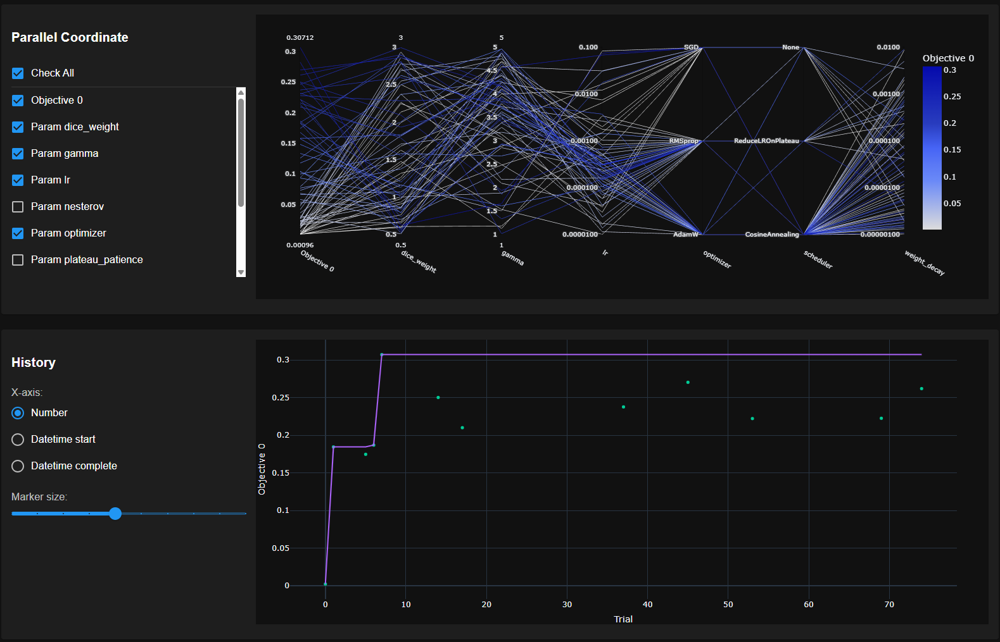
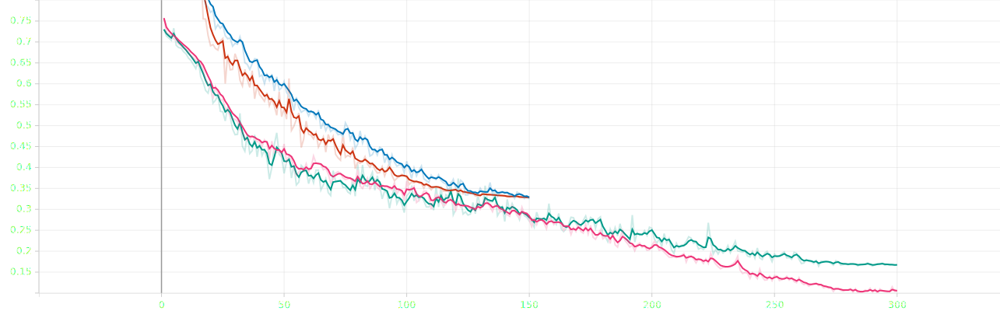
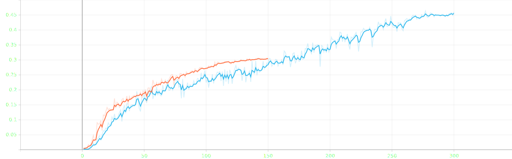
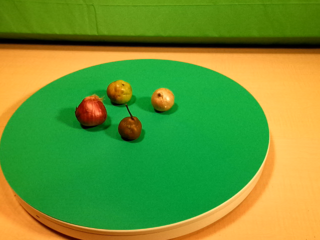
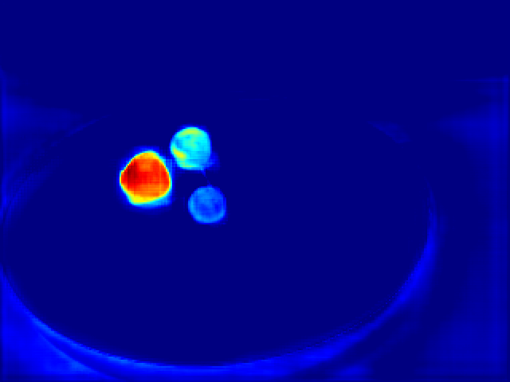
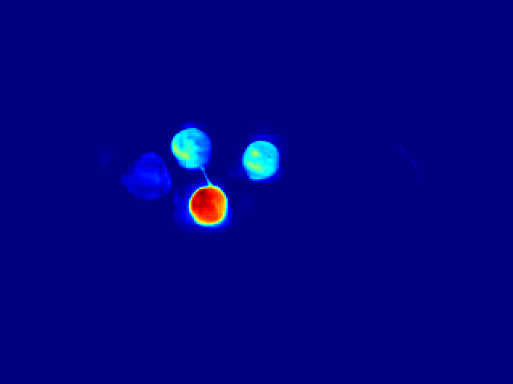
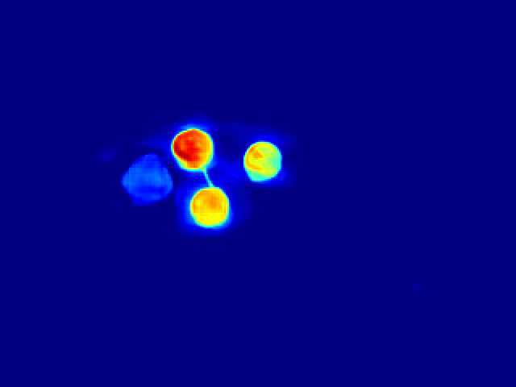
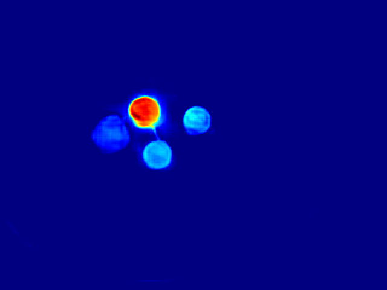
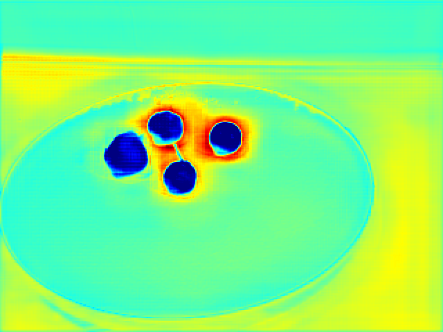

# TriModal Segmentation: RGB-D-T Tensor Using Adapted 5-channel YOLO & Pipeline Template

An experiment demonstrating the mathematical viability of 5-channel multi-modal tensor fusion (RGB, Depth, Thermal) for anomaly segmentation in images of fruits (e.g., fruit freshness, bruising, rot) using the MM5 dataset, as well as the creation of a training pipeline to iteratively test sensor fusion models.

## 🔬 MLOps Protocol
This pipeline strive to adhere to the Continuous Training (CT) MLOps architecture (Level 1/2) for reproducibility during algorithm development.

To eliminate human error (i.e. people making "bad choices"), training is orchestrated via an autonomous State Machine. The pipeline enforces Curriculum Learning, automatically cascading weights through strict mathematical phases:
1.  Baseline: Warm-up phase establishing initial feature extraction.
2.  Hyperparameter Optimization (HPO): Automated Bayesian search via Optuna to determine the mathematical ceiling for learning rate, momentum, and focal loss parameters.
3.  The Naruto Run: Aggressive structural mapping using optimal hyperparameters. Not "Hero" level yet because we have no largescale compute.
4.  Microtune: Flat-decay edge refinement for sub-millimeter precision.

## 🗄️ Data Version Control (DVC)
To ensure absolute reproducibility between training logs and dataset states, all multi-modal images will be/are tracked via `dvc` and stored remotely in Google Drive.
* The active dataset pointer is located at `dataset/MM5.dvc`.
* Do not manually alter the contents of the dataset folder without executing `dvc add dataset/MM5` and committing the resulting hash to Git.
* Refer to `DATA_CHANGELOG.md` for the strict historical lineage of all sensor additions and annotation corrections.

## 🚀 Execution & State Management
The pipeline is entirely self-aware. It dynamically reads the `results/` directory to determine its current curriculum phase.

To initiate or resume training:
```bash 
uv run train.py 
```
Note: To test a new architecture, add it to `models.py` and run `uv run train.py --model YourNewModel`.

---

## 📊 Empirical Results & Analysis

### Hyperparameter Optimization (HPO)
Optuna executed a 30-trial Hyperband-pruned sweep to establish the mathematical ceiling for the architecture under aggressive affine and thermal-drift augmentations.


Figure 1: Parallel Coordinate Plot detailing the Optuna trials. The converging lines track the hyperparameter combinations, with the darkest paths indicating the specific routing that yielded the highest objective value (Validation mIoU).

* Optimal Optimizer: SGD with Nesterov Momentum
* Optimal Learning Rate: 0.0753
* Focal Gamma: 1.6627
* Analysis: High momentum (0.968) paired with SGD was required to punch through the heavy spatial noise introduced by the modernized Affine augmentations, outperforming AdamW in avoiding local minima. The parallel plot visually confirms that higher learning rates clustered tightly with the SGD optimizer for peak performance.

### Training Trajectory (TensorBoard)
The Hero and Microtune phases demonstrated smooth asymptotic convergence with no signs of overfitting.


Figure 2: Training Loss vs. Validation Loss across the 300-epoch Naruto Run. The tight grouping indicates excellent mathematical generalization without dataset texture memorization.


Figure 3: Validation mIoU progression, capturing the network's geometric precision scaling up to a peak plateau before early stopping was triggered.

* Final Validation mIoU: 0.4604
* Analysis: The network successfully fused the 5-channel data. The steep plunge visible in the earlier epochs of the loss curves maps perfectly to the Cosine Annealing scheduler, where the model rapidly escaped the initial chaos and settled into a highly stable structural feature space.

---
## 🧠 Model Explainability (Semantic Grad-CAM)
Deep neural networks are susceptible to the "Clever Hans" effect—learning background artifacts, lighting conditions, or secondary textures instead of the intended agricultural targets. To validate the viability of the RGB-D-T fusion, this pipeline executes a Gradient-weighted Class Activation Mapping (Grad-CAM) pass upon phase completion.

Heatmaps are exported to `results/<ModelName>/<Run>/explainability/`.

How to Interpret the Heatmaps:
* Deep Red / Orange Zones: These pixels provided the highest mathematical gradient. The network explicitly used this specific geometric or thermal texture to classify the anomaly.
* Blue / Cool Zones: These pixels were suppressed by the network and ignored during classification.
* Validation Standard: A successful model will show red zones tightly hugging the physical boundaries of the object. If the red zone highlights a background object, the model is biased and the dataset probably requires heavier augmentation.

The following extractions from our MM5 diagnostic logs demonstrate how the network prioritizes specific multi-modal sensor inputs, and crucially, how we use these heatmaps to debug architectural bias.

### Case Study 1: Precise Class Isolation


Figure 4: The raw RGB input containing four distinct agricultural items on the inspection turntable.





Figure 5 (Top: Red Onion | Bottom: Pear): Successful class isolation. Notice how the highest gradient regions (deep red) strictly adhere to the localized spatial boundaries of the targeted item. The network successfully suppresses the adjacent items (cool blue regions), proving a mature reliance on the combined RGB-D-T channels to differentiate specific agricultural phenotypes.

### Case Study 2: Debugging Feature Entanglement
Grad-CAM is not just a presentation tool; it is a critical diagnostic mechanism used to audit the network during the Microtune phase.





Figure 6 (Top: Diagnostic Failure | Bottom: Corrected Activation): An example of feature entanglement. During an earlier, sub-optimal training phase (Top), the network failed to isolate the "Green Apple" class, incorrectly activating its gradients on the surrounding items. By auditing this heatmap, we confirmed the model had fallen into a local minimum. The fully optimized pipeline (Bottom) successfully resolves the feature space, pinning the activation strictly to the target apple.

### Case Study 3: Environmental Artifact Rejection


Figure 7: Catching environmental bias. In this diagnostic heatmap, the model exhibits a severe "shortcut" behavior. Instead of activating on the agricultural subjects, the network's gradients (red/yellow halos) have anchored onto the negative space and the thermal signature of an edge artifact. Finding this specific bias during the baseline runs directly informed our decision to deploy aggressive spatial augmentations during the HPO phase, forcing the model to learn scale-invariant fruit geometry rather than background pixels.

---

## ⚙️ Edge Deployment & Quantization (Jetson Orin Nano Super)
The pipeline automatically freezes the PyTorch computational graph and serializes it to a universally portable `.onnx` artifact located in `results/<ModelName>/<Run>/deployment/`, allowing for hardware-specific quantization testing.

Note: TensorRT engines must be compiled directly on the target Ampere silicon.

1. Transfer the `.onnx` file to the Jetson Orin Nano Super.
2. Execute NVIDIA's `trtexec` to quantize the 32-bit floating-point weights to FP16 and fuse the memory operations.

```bash 
/usr/src/tensorrt/bin/trtexec \   --onnx=trimodal_seg_dynamic.onnx \   --saveEngine=trimodal_seg_fp16.engine \   --fp16 \   --workspace=4096 \   --optShapes=input_rgbdt:1x5x480x640 \   --minShapes=input_rgbdt:1x5x480x640 \   --maxShapes=input_rgbdt:4x5x480x640 
```
This benchmark will confirm whether the heavy 5-channel tensor architecture can maintain 30+ FPS inference speeds under strict edge hardware constraints.

---

## 🗣️ Discussion: Architectural Trade-offs
Our experiment utilizing an early-fusion Convolutional Neural Network (TriModalYOLOSeg) achieved a baseline validation mIoU of 46.04%. While this successfully proves the mathematical viability of fusing 5-channel tensors, we must contextualize this against the state-of-the-art architectures published by the MM5 dataset creators, who achieved 88.3% (GF-Net) and 84.18% (CMAG).

This performance delta highlights a fundamental MLOps design trade-off between ultimate segmentation fidelity and embedded edge deployment capabilities:

* The "Where to Fuse" Dilemma: Our architecture stacks RGB, Depth, and Thermal into a single 5-channel tensor at the input layer (Early Fusion). While this is incredibly fast, it operates on a lethal assumption: pixel-perfect spatial alignment. Brenner et al. demonstrated that spatial entanglement at the encoder level creates cascading failures if sensor parallax or mechanical vibrations shift the thermal/depth pixels. Their CMAG architecture utilizes Decoder-Level (Late) Fusion, processing each sensor through an independent backbone before fusing at the pre-logit stage, allowing the network to survive mechanical shifts of up to 40 pixels with minimal degradation.
* CNNs vs. Transformers: By utilizing a YOLO-based CNN, our pipeline prioritizes high-speed spatial feature extraction custom-tailored for Ampere edge silicon (such as the Jetson Orin Nano). In doing so, we traded away the Global Context Modality Attention (GCMA) found in their SegFormer (MiT-B0) backbone. Transformers use global attention to find cross-modal correlations (e.g., matching a thermal delta to an RGB texture) that CNNs structurally struggle to capture.

---

## 🏁 Conclusion & Next Steps: Hardware Deployment Strategy
This POC successfully validated our training state machine and the mechanics of RGB-D-T tensor fusion. However, as we transition from algorithmic baselines to deploying our own physical sensor arrays and sorting hardware, we must implement several critical pipeline upgrades derived from the MM5 methodology to avoid alignment and normalization failures:

1. Abandon Auto-Gain Thermal (DTMRE): Standard Automatic Gain Control (AGC) ruins thermal consistency across frames. We must implement Deterministic Thermal Multi-Resolution Encoding (DTMRE) to map raw 16-bit temperature values to fixed 24-bit color gradients. This prevents the network from memorizing relative scene brightness instead of true metabolic temperature.
2. Adaptive Depth Encoding (ADMRE): Uniformly quantizing 16-bit depth into 255 values destroys geometric edge fidelity. We will integrate Adaptive Depth Multi-Resolution Encoding (ADMRE) using Kernel Density Estimation to concentrate our bit-depth resolution strictly within the physical envelope of the target.
3. Modality-Wise Normalization: We will update our ingestion scripts to calculate exact, dataset-wide means and standard deviations independently for the Thermal and Depth channels, rather than applying a blanket ImageNet normalization that corrupts cross-spectral amplitude differences.
4. Hardware Calibration & Annotation (MAR): We cannot calibrate a thermal camera with a standard printed checkerboard. We will adopt the use of copper-plated, heated checkerboards for accurate thermal-to-RGB spatial calibration. Furthermore, to eliminate manual annotation bottlenecks on blurry auxiliary feeds, we will implement Multimodal Annotation Remapping (MAR) to mathematically project high-resolution RGB annotations directly onto the raw thermal/UV canvas using inverse calibration matrices.

---

## 🙏 Acknowledgments & Citations
This project would not be possible without the MM5 Dataset. We sincerely thank the original creators and authors for their foundational work in multi-modal data collection, hardware synchronization, and curation, which enabled the training and evaluation of this architecture.

If you utilize this pipeline, the underlying architecture, or the data, please cite the primary publication alongside the dataset repository:

Primary Publication:
> Brenner, M., Reyes, N. H., Susnjak, T., & Barczak, A. L. C. (2026). MM5: Multimodal image capture and dataset generation for RGB, depth, thermal, UV, and NIR. Information Fusion, 126, 103516.

> DOI: https:doi.org/10.1016/j.inffus.2025.103516

Dataset:
> Brenner, M., Reyes, N., Susnjak, T., & Barczak, A. (2025). MM5: Multimodal Image Dataset. figshare. Dataset.

> DOI: https:doi.org/10.6084/m9.figshare.28722164